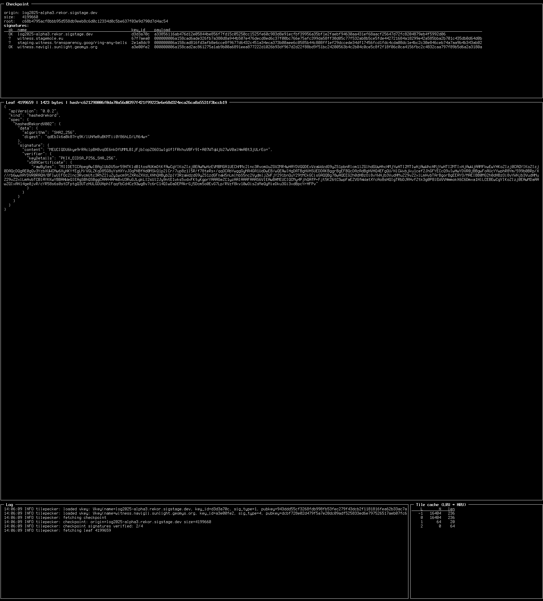

# tilepecker



Another take on [woodpecker](https://github.com/transparency-dev/incubator/tree/main/woodpecker-web), based on [tlog-scales](https://github.com/florolf/tlog-scales).

Can parse different leaf entry formats and verify log/cosignatures.

**Caveat emptor**: This UI is 100% vibe coded garbage, but the stuff that is actually load-bearing (tlog-scales) has been written by hand by myself.

Usage, e.g.:

```
$ tilepecker https://log2025-alpha3.rekor.sigstage.dev --vkey 'log2025-alpha3.rekor.sigstage.dev+d3d3a70c+AZQ93VXPMmj9uZj7U/7CefQ9yy8RgYFv6mKzOseipjqp' --vkey 'witness.navigli.sunlight.geomys.org+a3e00fe2+BNy/co4C1Hn1p+INwJrfUlgz7W55dSZReusH/GhUhJ/G' --format json
```
